# CleanFlow Pro (净流) - Windows 原生资产治理与毫秒检索桌面引擎

[](LICENSE)
[-0078d4.svg)](#)
[](https://www.rust-lang.org/)
[](#)
[](#)
[](#)

CleanFlow Pro 是一款基于 Rust 原生内核打造的高性能、工业级 Windows 桌面软件。软件采用原生单文件便携式绿色架构（二进制体积仅 ~9.6 MB，解压即用），完全零外部运行时依赖（无需 Node.js / Python / WebView2 运行时），深度融合 Windows 11 Fluent Design 与 Nordic Mica 深色玻璃拟态视觉规范。

产品拥有三大业务支柱：
1. **工业级磁盘空间资产治理引擎**：对标 CCleaner / WizTree / DaisyDisk，提供系统冗余专清、交互式全盘 Treemap 树图、NTFS 事务型跨盘搬家 (Junction)、ReFS 写时复制去重 (Block Clone)、注册表无损备份回滚、SQLite 物理收缩、Windows 驱动存储池安全清理、系统休眠与保留存储调优、以及基于微软官方 Cloud Filter (`cldapi.dll`) 的云端同步盘离线缓存脱水释放；
2. **毫秒级全盘桌面搜索与启动中枢**：全面深度吸收 Listary Pro 与 fsearch 核心体验，提供基于 NTFS USN/MFT 的底层极速检索、多音字与双字母复合声母 (zh/ch/sh) 智能拼音检索引擎、类型过滤胶囊标签、虚拟视口 60fps 极速滚动、双击 Ctrl / Alt+Space Spotlight 全局悬浮窗、文件对话框快速跳转 (Quick Switch) 及智能动作中枢；
3. **智能空间护航与自愈规则引擎**：集成 Win32 原生全屏独占与游戏免打扰感知、键鼠空闲低优先级调度、时序空间消耗斜率 (Burn-rate) 预测与耗尽倒计时预警、以及低容量自适应自愈规则引擎。

---

## 开发者与架构文档导航

- **协作法则与安全守则 (Tier 2 法)**: [CLAUDE.md](CLAUDE.md)
- **系统单源真值与模块地图 (Tier 2 事)**: [AGENTS.md](AGENTS.md)
- **全域架构与业务文档总控 (Tier 3)**: [docs/README.md](docs/README.md)
- **演进路线图与前沿规划**: [ROADMAP.md](ROADMAP.md)

---

## 架构概览与技术拓扑

```mermaid
graph TD
    subgraph UI_Layer["前端交互层 (Fluent Mica UI / Spotlight 悬浮窗)"]
        W1["工作区 1: 极速空间清理 (Clean)"]
        W2["工作区 2: 空间透视与去重 (Analyze)"]
        W3["工作区 3: 残留与死链瘦身 (Purge)"]
        W4["工作区 4: 深度极客工具箱 (Tools)"]
        W5["工作区 5: 毫秒文件检索 (Search)"]
        W6["交互层: Spotlight 悬浮搜索栏 (Alt+Space / 双击Ctrl)"]
        W7["交互层: 智能文件对话框跳转 (Ctrl+G Quick Switch)"]
    end

    subgraph Core_Engine["Rust 高性能服务内核 (tiny_http 桥接)"]
        Scanner["多线程扫描器 (jwalk / 规则引擎)"]
        Cleaner["安全清理管道 (进程排他锁防护)"]
        DupEngine["BLAKE3 三级分水岭智选查重引擎"]
        RegEngine["注册表死链探测与备份回滚"]
        JunctionEngine["NTFS Reparse Point 软链接虚拟化"]
        VacuumEngine["winsqlite3 动态调用与 Freelist 整理"]
        StorageAuditEngine["驱动存储池与系统休眠诊断 (pnputil / powercfg)"]
        CloudEngine["云端同步盘脱水治理 (cldapi.dll 原生脱水)"]
        GuardEngine["智能空间护航引擎 (全屏避让 / 时序预测 / 自愈)"]
        SearchEngine["USN/MFT 毫秒检索引擎 + Trigram 缓存"]
        PinyinEngine["ToPinyinMulti 多音字与复合声母归一化匹配器"]
        ActionEngine["智能动作中枢 (宏模板展开 & 权限提权)"]
        TrayEngine["Win32 原生托盘消息泵与自启管理"]
        IconEngine["Win32 SHGetFileInfoW 原生高DPI图标提取器"]
    end

    subgraph OS_Kernel["Windows 操作系统底层"]
        Win32_FS["NTFS / ReFS 文件系统 (USN, MFT, Block Clone)"]
        Win32_Reg["Windows 注册表 (HKCU / HKLM)"]
        Win32_Shell["Win32 Shell32 / Shell_NotifyIcon / HotKey / SHQueryUserNotificationState"]
        Win32_API["Restart Manager / winsqlite3.dll / cldapi.dll / PnPUtil"]
    end

    W1 --> Scanner
    W1 --> Cleaner
    W2 --> Scanner
    W2 --> DupEngine
    W3 --> RegEngine
    W4 --> JunctionEngine
    W4 --> VacuumEngine
    W4 --> StorageAuditEngine
    W4 --> CloudEngine
    W4 --> GuardEngine
    W5 --> SearchEngine
    W5 --> PinyinEngine
    W5 --> IconEngine
    W6 --> SearchEngine
    W6 --> ActionEngine
    W7 --> ActionEngine

    Cleaner --> Win32_FS
    DupEngine --> Win32_FS
    RegEngine --> Win32_Reg
    JunctionEngine --> Win32_FS
    VacuumEngine --> Win32_API
    StorageAuditEngine --> Win32_API
    CloudEngine --> Win32_API
    GuardEngine --> Win32_Shell
    SearchEngine --> Win32_FS
    TrayEngine --> Win32_Shell
    IconEngine --> Win32_Shell
```



---

## 核心功能矩阵

### 支柱一：工业级磁盘空间资产治理 (Storage Governance)

#### 1. 极速空间清理 (Clean)
- **环形空间健康度仪表盘**：动态感知各盘物理余量与可回收规模。
- **多维分类光谱占比条 (Spectrum Bar)**：动态呈现系统冗余、现代开发、办公通讯、浏览器、数据库等维度的色彩编码分布。
- **六大场景深度专清**：
  - **系统临时垃圾**：用户 `%LOCALAPPDATA%\Temp`、Windows 错误报告与补丁残留；
  - **现代开发套件缓存**：Cargo、Pip、Gradle、Android Studio、Cursor、Unity 编译缓存；
  - **微信与办公深度专清**：微信 4.0 日志、月度离线多媒体、旧版 XPlugin 与飞书缓存；
  - **主流浏览器专清**：Edge 与 Chrome 离线多媒体与 IndexedDB 冗余；
  - **全盘回收站安全清空**：底层跨卷清空与容量感知；
  - **空目录扫描**：快速清理嵌套深层的 0 字节幽灵空壳目录。

#### 2. 空间透视与去重 (Analyze)
- **大文件全盘 Treemap 空间矩形树图**：
  - 对标 WizTree / DaisyDisk 工业级空间树图，按文件物理尺寸动态比例自适应划分 12 栅格矩阵色块；
  - 数据库资产（青色）、虚拟机磁盘（紫色）、安装包（琥珀橙）、压缩归档（宝蓝色）分类高光；
  - **防截断双层检查条 (Inspector Strip)**：悬停/点击色块时联动呈现物理路径与治理建议，内置原生 `[定位目录]`、`[复制路径]`、`[VACUUM 压缩]`、`[Junction 搬家]` 快捷按钮。
- **BLAKE3 三级分水岭重复文件智选去重**：
  - 一级体积碰撞桶 + 二级 16KB 头部特征散列 + 三级 BLAKE3 树状并发散列；
  - 自动将最早创建/修改的母本标记为“推荐保留”，多余副本标记为“冗余副本”并一键批量清理；
  - 严格忽略 0 字节文件，杜绝误报。

#### 3. 残留与死链瘦身 (Purge)
- **软件卸载孤立残留**：深度扫描已卸载软件残留在 `AppData\Local` 与 `AppData\Roaming` 的无主配置与缓存目录；
- **注册表死链与失效自启修复**：
  - 扫描并修复 MUICache 失效映射、OpenWith 失效右键打开方式与失效自启动项；
  - **全自动标准 .reg 备份机制**：每次清理前自动在临时目录生成带有高精度时间戳的标准 Windows .reg 快照文件，支持双击一键原生合并回滚。

#### 4. 深度极客工具箱 (Tools)
- **目录无损跨盘搬家向导 (NTFS Junction)**：
  - **AI 与开发者资产预设**：内置 Ollama、HuggingFace、PyTorch、Steam、Unity Hub、Visual Studio Packages、微信聊天资产与 Android SDK 一键填入；
  - **互斥进程安全预检 (Process Inspector)**：毫秒级全并发检测待搬迁目录是否被应用独占锁定，提供友好告警与一键终止进程，避免搬迁中途写入冲突；
  - **多线程无缓存传输与事务置换**：基于 robocopy 多线程无缓存传输，自动创建 NTFS Junction 虚拟软链接，支持随时安全回滚。
- **ReFS 块克隆写时复制去重 (Block Clone)**：
  - 针对 Windows 11 Dev Drive (ReFS) 分区，调用 Win32 `FSCTL_DUPLICATE_EXTENTS_TO_FILE`；
  - 副本文件在文件系统视图中依然完整存在，物理磁盘只占用一份数据，修改时自动触发写时复制 (CoW)。
- **数据库碎片物理压缩 (SQLite VACUUM)**：
  - 动态加载系统原生 `winsqlite3.dll`，整理 Cursor / IDE 的 `state.vscdb` 等膨胀数据库中的 Freelist 空闲游离页。
- **Windows 驱动存储池安全清理 (DriverStore)**：
  - 穿透调用 `pnputil /enum-drivers` 深度枚举已注册 OEM 驱动，精准映射 `C:\Windows\System32\DriverStore\FileRepository` 真实物理目录尺寸；
  - 驱动多版本智能分组归一化比对算法，自动标定被新版本替换的陈旧冗余驱动（实测识别 1.34 GB+ 历史 Intel/Realtek 驱动）；
  - 严格校验 `oem*.inf` 命名规范，通过 Windows 官方受保护管道执行卸载，坚决不进行粗暴物理文件删除，确保硬件引导安全。
- **系统休眠与保留存储空间调优 (Hibernation & Reserved Storage)**：
  - 穿透检测 `C:\hiberfil.sys` 实际占用与休眠状态；
  - 提供 `powercfg /hibernate` 三档模式向导（完全关闭释放、开启精简快速启动、恢复完整休眠）；
  - 读取注册表 `ReserveManager` 键值，高精度诊断 Windows 11 保留存储状态（约 6.5 GB），提供安全 DISM 调优指引。
- **云端同步盘离线缓存脱水释放 (Cloud Storage Dehydration)**：
  - 自动探测多源云盘本地同步根目录（OneDrive 个人/商业版、iCloud、坚果云、百度网盘、阿里云盘等）；
  - 基于 Win32 `GetCompressedFileSizeW` 穿透比对逻辑名义大小与实际物理分配大小，精准识别“已下载物理缓存”与“纯云端占位符”；
  - 动态链接微软官方 Cloud Filter 库 (`cldapi.dll`)，调用 `CfDehydratePlaceholder` 与 `CfSetPinState` 原生脱水本地物理簇，回退支持系统级 `attrib.exe +U -P`；
  - **云端数据绝对安全底线**：严禁调用任何物理删除指令，脱水后本地物理扇区归零，仅保留轻量占位符，云端数据 100% 完好无损。

---

### 支柱二：毫秒级全盘桌面搜索与启动中枢 (Search & Launcher)

#### 1. 底层极速检索内核 (USN & MFT)
- **NTFS 卷底层直读**：通过 Windows 原生 `DeviceIoControl` 调用 `FSCTL_QUERY_USN_JOURNAL` 与 `FSCTL_ENUM_USN_DATA`，瞬间枚举数百万文件元数据；
- **Trigram 内存加速器**：针对海量元数据构建 3-gram 字符索引表，实现万级以上记录的微秒级流式过滤；
- **开发噪声自动屏蔽盾 (Dev Noise Shield)**：默认过滤 `node_modules`、`.git`、`target`、`.venv` 等超深层代码噪音，支持在搜索框敲入 `noise:all` 临时解除。

#### 2. 多音字与双字母复合声母 (zh/ch/sh) 智能拼音引擎
- **多音字全覆盖 (ToPinyinMulti)**：
  - 汉字多音字（如重、行、长、乐、调、降、会、差、藏）自动生成双向变体索引；
  - 输入 `cq` 或 `zq` 均能 100% 命中 `重庆.pdf`；
  - 输入 `yh` 或 `yx` 均能 100% 命中 `银行明细.xlsx`；
- **双字母声母 (zh/ch/sh) 归一化**：
  - 输入 `zhw` 自动映射为 `zw`，命中 `中文.txt`；
  - 输入 `chq` 自动映射为 `cq`，命中 `传奇.exe`；
  - 输入 `shj` 自动映射为 `sj`，命中 `升级补丁.zip`；
  - 用户输入 `zw` / `cq` / `sj` 同样享受满额前缀分匹配。

#### 3. 面向大众用户的现代交互与视觉体验
- **可视化类型过滤药丸 (Filter Chips)**：
  - 在搜索栏下方提供点选标签：`[全部]`、`[文件夹]`、`[文档]`、`[图片]`、`[视频]`、`[音乐]`、`[压缩包]`、`[程序]`；
  - 普通用户无需记忆 `type:dir` 或 `pic:` 语法，点击药丸即刻过滤对应类型；
- **虚拟视口复用渲染引擎 (Virtual Viewport)**：
  - 页面 DOM 常驻仅 25~30 行元素，结合上下空白占位器自适应定位；
  - 放开单次 100 条限制，支持 10,000+ 条巨量结果流式滚动，帧率稳定在 60fps；
- **Win32 原生文件关联官方图标提取 (Icon Extractor)**：
  - 调用 `SHGetFileInfoW` 提取各扩展名对应的系统真实官方图标与可执行程序内嵌图标；
  - 原生无损 PNG 内存编码器，支持 125%、150%、200% 高 DPI 缩放物理分辨率自适应。

#### 4. Windows 原生系统深度集成 (Listary Pro 级对齐)
- **原生系统托盘常驻 (System Tray)**：
  - Win32 `Shell_NotifyIconW` 原生消息循环，支持托盘常驻与右键菜单（打开控制台、呼出 Spotlight、切换开机自启动、安全退出）；
  - 退出时彻底清除通知区图标，杜绝幽灵残影残留；
- **开机自启动管理**：
  - 注册表 `HKCU\Software\Microsoft\Windows\CurrentVersion\Run` 纳管，支持标题栏一键切换；
- **全局呼出热键 (Spotlight & Quick Switch)**：
  - **双击 Ctrl**（Win32 `WH_KEYBOARD_LL` 签名级按键手势检测，350ms 阈值）；
  - **Alt + Space**（Win32 `RegisterHotKey` 备份热键）；
  - **Ctrl + G / Quick Switch**：智能嗅探前台文件打开/另存为对话框 (`#32770`)，一键将当前选中路径填充至对话框。

#### 5. 智能动作中枢 (Smart Action Hub)
- **6 大内置高频动作**：资源管理器定位、复制物理路径、以管理员身份打开、VS Code 打开、系统属性查看、BLAKE3 校验码计算；
- **自定义动作 GUI 编辑表单**：
  - 支持在设置面板中添加任意外部程序（如 Cursor、Beyond Compare、Everything、脚本等）；
  - 支持宏替换变量：`{path}`（绝对全路径）、`{dir}`（父目录）、`{name}`（全名）、`{basename}`（文件名）、`{ext}`（扩展名）；
  - 支持双引号包裹参数与空格安全切分，支持勾选管理员提权与快捷键绑定。

#### 6. 图形化排除规则管理器 (Exclusions Manager)
- 支持用户在图形界面添加排除路径、通配符（如 `*.log`、`temp_*`）与正则表达式黑名单；
- 支持内置开发规则一键启用/禁用，检索时全局自动过滤。

---

### 支柱三：智能空间护航与自愈规则引擎 (Intelligent Guard & Self-Healing)

#### 1. Win32 全屏独占与游戏免打扰感知 (Full-screen & Gaming Suppression)
- 调用 Win32 原生 `SHQueryUserNotificationState` 深度感知用户全屏应用、DirectX/Vulkan 独占游戏（`QUNS_RUNNING_D3D_FULL_SCREEN`）及 PPT 演示放映状态；
- 在用户游戏、观影或演示时段自动静默所有弹窗通知并延迟执行繁重维护任务，实现绝对零打扰。

#### 2. 键鼠空闲调度 (Idle Detection)
- 基于 Win32 `GetLastInputInfo` 毫秒级计算系统真实键鼠空闲时长；
- 仅在用户离席超过安全阈值（默认 5 分钟）时才触发后台低优先级治理任务，工作时零卡顿无感伴随。

#### 3. 时序空间消耗斜率 (Burn-rate) 预测与预警
- 采用滑动窗口时序算法，动态拟合各驱动器可用空间变化曲线与消耗速率（MB/min）；
- 突发空间吞噬（如构建爆炸、日志雪崩、虚拟机膨胀）时自动触发预警并推算耗尽倒计时，告别 C 盘爆满红条措手不及。

#### 4. 轻量本地自愈规则引擎 (Local Self-Healing Engine)
- 内置三大安全自愈管道：
  - **紧急低容量回收站清空**：当系统分区可用空间低于危险阈值时自动清空回收站安全兜底；
  - **空闲时系统临时垃圾收缩**：系统空闲时自动静默清理超过 7 天未修改的 `%TEMP%` 孤立文件；
  - **超期云盘缓存自动脱水**：自动扫描并脱水超过 90 天未访问的云端大文件，回退为纯云端占位符；
- 规则具备冷却时间防御与全屏避让拦截，纯本地执行，无任何静默网络通信。

---

## 物理机实测治理与检索指标

在实际 Windows 11 x64 开发机上的全量实测数据：

| 评估维度 | 指标参数 | 实测性能与表现 | 行业对比标杆 |
| :--- | :--- | :--- | :--- |
| **全盘 100MB+ 巨型资产遍历** | 1,000,000+ 文件元数据 | 耗时仅 **0.68 秒** | 优于 WinDirStat (45s+)，比肩 WizTree |
| **全盘首字母拼音检索** | 输入 `jsq` / `zhw` / `cq` | 响应时间 **< 15 毫秒** | 优于传统 Everything 字符子序列模式 |
| **虚拟视口渲染滚动** | 1,000 条搜索结果列表 | **60 fps** 惯性平滑滚动，内存占用保持平稳 | 消除原生网页卡顿与 DOM 膨胀 |
| **目录跨盘迁移 (Junction)** | 15.8 GB 真实开发/AI 资产 | 耗时 42 秒（robocopy /MT:16 /J），秒级建立联接 | 零报错，原应用透明访问 |
| **注册表扫描与备份** | 20,000+ 系统注册表键值 | 耗时 0.9 秒，自动生成带时间戳标准 `.reg` 备份 | 100% 无损原生回滚支持 |
| **驱动存储池废弃包诊断** | 扫描 `pnputil` 与 `FileRepository` | 耗时 **0.3 秒**，安全匹配 1.34 GB+ 历史旧显卡/蓝牙驱动 | 优于第三方粗暴物理删除 |
| **单文件发布体积** | Release 二进制 | **9.67 MB**（无须安装，解压即用） | 远小于 Electron 类软件 (150MB+) |
| **自动化测试覆盖** | 核心逻辑覆盖率 | **90 / 90** 项单元测试 100% 通过 | 零 Warning，100% 绝对零 Emoji |

---

## 编译、构建与运行指南

### 系统要求
- 操作系统：Windows 10 / Windows 11 (x64)
- 编译工具：Rust 1.75+ (Cargo)

### 快速启动与测试
```powershell
# 1. 运行全量 90 项自动化测试套件
cargo test

# 2. 编译生产级高优化单文件可执行文件
cargo build --release

# 3. 运行 CleanFlow Pro (默认打开内置桌面控制台)
.\target\release\cleanflow.exe

# 4. 以后台静默托盘模式启动
.\target\release\cleanflow.exe --silent
```

### 常用命令行参数
- `--silent`: 静默模式，启动后直接常驻右下角系统托盘，不自动弹出浏览器控制台；
- `--port <PORT>`: 指定本地服务绑定端口（默认自动嗅探空闲端口）；
- `--daemon`: 作为常驻后台服务运行；
- `--version`: 打印当前原生引擎版本号。

---

## 开源协议

本项目采用 [MIT 许可证](LICENSE) 发布。
