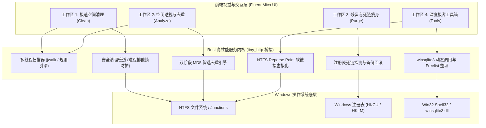

# CleanFlow Pro (净流) - Windows 资产治理桌面引擎

[](LICENSE)
[-0078d4.svg)](#)
[](https://www.rust-lang.org/)
[](#)

CleanFlow Pro 是一款基于 Rust 原生内核打造的高性能、工业级 Windows 磁盘空间资产治理桌面软件。软件采用原生单文件便携式架构（压缩包仅 ~2 MB，解压即用），完全零外部运行环境依赖（无需 Node.js / Python / WebView2 运行时），深度融合 Windows 11 Fluent Design 与 Nordic Mica 深色玻璃拟态视觉规范。

---

## 架构概览与技术拓扑



---

## 四大核心收敛工作区

### 1. 极速空间清理 (Workspace 1: Clean)
* **环形空间健康度仪表盘**：动态感知系统盘余量与可回收规模。
* **多维分类光谱占比条 (Spectrum Bar)**：动态呈现多色比例光谱，直观展现系统临时、现代开发、办公通讯、浏览器、数据库等维度的色彩编码分布，配备胶囊药丸图例与精确体积百分比。
* **六大场景深度专清**：
  * **系统冗余与临时垃圾**：用户 `%LOCALAPPDATA%\Temp`、Windows 更新补丁与错误报告。
  * **现代开发套件缓存**：Cargo、Pip、Gradle、Android Studio、Cursor、Unity 编译缓存。
  * **微信与办公深度专清**：微信 4.0 日志、月度离线多媒体、旧版 XPlugin 与飞书缓存。
  * **主流浏览器专清**：Edge 与 Chrome 离线多媒体与 IndexedDB 冗余。
  * **全盘回收站清空**：底层跨卷清空，支持回收站容量感知。
  * **孤立空目录扫描**：快速清理嵌套深层的 0 字节幽灵空壳目录。

### 2. 空间透视与去重 (Workspace 2: Analyze)
* **大文件全盘 Treemap 空间矩形树图 (标杆级)**：
  * 对标 WizTree / DaisyDisk / WinDirStat 工业级空间树图，按文件物理尺寸动态比例自适应划分 12 栅格矩阵色块。
  * 数据库资产（青色高光）、虚拟机磁盘（紫色高光）、安装包（琥珀橙）、压缩归档（宝蓝色）分类分色。
  * **防截断双层检查条 (2-Row Inspector Strip)**：悬停/点击色块时联动呈现文件名、体积占比、绝对物理路径与治理建议，内置原生 `[定位目录]`、`[复制绝对路径]`、`[VACUUM 压缩]`、`[Junction 搬家]` 快捷按钮，并与下方明细表格双向平滑联动。
* **大文件全盘雷达**：多线程并行检出全盘 100 MB+ 巨型沉淀资产，支持数据库、虚拟机磁盘、安装包与压缩包精准分类。
* **重复文件智选去重**：
  * 基于双阶段特征比对算法（文件体积初筛 + 4KB 头部哈希 + 完整 MD5 校验）。
  * 智能策略：自动将最早创建/修改的母本标记为“推荐保留”，多余副本标记为“冗余副本”并一键批量清理。

### 3. 残留与死链瘦身 (Workspace 3: Purge)
* **软件卸载孤立残留**：深度扫描已卸载软件残留在 `AppData\Local` 与 `AppData\Roaming` 的无主配置与缓存目录。
* **注册表死链与失效自启**：
  * 扫描并修复 MUICache 失效程序映射、OpenWith 失效右键打开方式与失效自启动项。
  * **安全回滚机制**：清理前自动在临时目录导出带有时间戳的 `.reg` 原生备份文件，支持随时双击还原。

### 4. 深度极客工具箱 (Workspace 4: Tools)
* **Docker 虚拟镜像与 Buildx 治理**：实时感知 Docker Desktop 运行状态，提供构建缓存清理与全量系统瘦身。
* **目录无损跨盘搬家 (NTFS Junction)**：
  * 专治 Android Studio 模拟器镜像、微信聊天记录等默认占用 C 盘的大资产。
  * 物理搬移至 D/E 盘后原位生成 0 字节透明软链接，软件无感照常运行，支持一键安全还原 (Rollback)。
* **数据库碎片物理压缩 (SQLite VACUUM)**：
  * 动态加载系统原生 `winsqlite3.dll`。
  * 整理 Cursor / IDE 的 `state.vscdb` 等膨胀数据库中的 Freelist 空闲游离页，实现无损物理压缩。

---

## 物理机实测治理指标

在实际 Windows 11 x64 开发机上的全量治理效果验证：

| 治理维度 | 治理前状态 | 治理后实测 | 净改善收益 |
| :--- | :--- | :--- | :--- |
| **C 盘物理可用空间** | **28.97 GB** (85% 已用) | **44.18 GB** (78% 已用) | **净回释 15.21 GB 物理空间** |
| **现代开发构建缓存** | 5.3 GB | 1.1 GB | 释放 4.2 GB 沉淀冗余 |
| **办公通讯离线缓存** | 1.5 GB | 199.7 MB | 释放 1.3 GB（聊天记录 100% 完好） |
| **全盘重复文件副本** | 21 组（43 项） | 0 组（0 项） | 冗余副本 100% 消除，母本完整保留 |
| **注册表死链与幽灵项** | 14 处失效项 | 0 处残留 | 100% 清理修复，附带 .reg 备份 |
| **后台资源占用** | 零服务常驻 | 零服务常驻 | 关闭窗口即退出，绝不侵占系统资源 |

---

## 安装与分发方式

### 方式 A：便携免安装（开箱即用）
1. 下载 `CleanFlow-Pro-v0.1.1-win64.zip` 并解压。
2. 双击 `cleanflow.exe` 或 `start-cleanflow.cmd` 即可直接启动。

### 方式 B：一键系统安装向导
1. 解压后双击运行 `Install.cmd`。
2. 脚本将自动完成：
   - 安装至用户本地软件目录 `%LOCALAPPDATA%\Programs\CleanFlow-Pro`。
   - 在 Windows 桌面与开始菜单创建快捷方式。
   - 在 Windows 系统设置的“已安装的应用”列表中登记卸载入口。
3. 卸载：在 Windows 设置中点击卸载，或双击运行 `Uninstall.cmd` 即可彻底移除。

---

## 源码构建指南

### 构建环境
* 操作系统：Windows 10 (1809+) 或 Windows 11 (x64)
* 工具链：Rust (`rustc` 1.80+ / Cargo)
* 依赖库：纯 Rust 标准实现与系统原生 Win32 API

### 编译 Release 版本
```powershell
git clone https://github.com/manhua-man/cleanflow-pro.git
cd cleanflow-pro
cargo build --release
```
编译产物位于 `target\release\cleanflow.exe`（单文件二进制体积仅约 6 MB）。

### 运行单元测试
```powershell
cargo test
```
全部 7 项核心单元测试（路径解析、哈希计算、注册表自启、Docker 探针、回收站统计、已装应用枚举）均应 100% 通过。

---

## 开源协议

本项目采用 MIT 许可证开源，详情请参阅 [LICENSE](LICENSE) 文件。
