# CleanFlow Pro 系统架构与技术拓扑 (Architecture Specification)

本文档系统性阐述 CleanFlow Pro 的原生工程架构、子系统划分、跨层数据流动与 Windows 原生底层集成机制。

---

## 1. 总体分层架构

CleanFlow Pro 采用 Rust 原生单二进制架构，整体划分为四大逻辑层：

```mermaid
graph TD
    subgraph UI_Layer["1. 原生前端交互层 (Fluent Mica UI)"]
        UI_Clean["工作区 1: 极速空间清理"]
        UI_Analyze["工作区 2: 空间透视与去重"]
        UI_Purge["工作区 3: 残留与死链瘦身"]
        UI_Tools["工作区 4: 深度极客工具箱"]
        UI_Search["工作区 5: 毫秒文件检索"]
        UI_Spotlight["Spotlight 悬浮搜索中枢 (Alt+Space / 双击Ctrl)"]
        UI_Dialog["文件对话框快速跳转 (Quick Switch)"]
    end

    subgraph Service_Bridge["2. 本地服务桥接层 (Embedded HTTP)"]
        HttpServer["tiny_http 高性能本地服务 (127.0.0.1)"]
        ApiRouter["RESTful JSON API 路由与分发"]
        StaticAsset["ui.html 静态资源内存直出"]
    end

    subgraph Core_Engines["3. Rust 高性能核心引擎层"]
        StorageEngine["磁盘空间治理引擎 (jwalk / WinApp2 / Junction / BlockClone / VACUUM)"]
        SearchEngine["USN/MFT 毫秒秒搜引擎 (Trigram / Pinyin / Fuzzy)"]
        GuardEngine["智能空间护航引擎 (全屏避让 / 时序预测 / 自愈规则)"]
        ActionEngine["智能动作中枢 (宏展开 / Runas 提权)"]
        TrayEngine["Win32 托盘消息循环与自启控制"]
    end

    subgraph Win32_Kernel["4. Windows 操作系统内核与系统调用"]
        NTFS_Driver["NTFS / ReFS (MFT, USN Journal, Reparse Point, FSCTL)"]
        Shell32["Shell32 (Shell_NotifyIcon, SHGetFileInfo, SHQueryUserNotificationState)"]
        Win32_Base["Kernel32 / User32 (WH_KEYBOARD_LL, RegisterHotKey, GetLastInputInfo)"]
        System_DLLs["系统动态库 (winsqlite3.dll, cldapi.dll, pnputil.exe)"]
    end

    UI_Layer --> Service_Bridge
    Service_Bridge --> Core_Engines
    Core_Engines --> Win32_Kernel
```

---

## 2. 核心子系统与关键设计

### 2.1 磁盘空间治理子系统 (Storage Governance)
- **多线程扫描与并发控制**：基于 `jwalk` 与 `rayon` 实现非阻塞的高并发目录树遍历，利用三级分水岭算法（体积 -> 16KB 头部特征散列 -> BLAKE3 全量并发树状散列）快速识别重复文件。
- **NTFS Junction 跨盘热搬迁**：基于 Windows 原生 Reparse Point (`mklink /J`) 技术与 robocopy 多线程无缓存传输，迁移前调用 Win32 `Restart Manager` 与进程锁探测 (`process_lock.rs`)，确保零写入冲突。
- **云端同步盘原生脱水 (`cloud_storage_audit.rs`)**：
  - 动态载入微软官方 `cldapi.dll`，调用 `CfDehydratePlaceholder` 与 `CfSetPinState`；
  - 穿透比对文件逻辑大小与物理分配大小，仅回收本地物理扇区，100% 保持云端资产完整。
- **驱动存储池废弃包治理 (`system_storage_audit.rs`)**：
  - 调用 `pnputil /enum-drivers` 穿透枚举，正则匹配 `C:\Windows\System32\DriverStore\FileRepository` 物理尺寸；
  - 多版本分组归一化比对，通过受保护管道安全卸载，严禁物理硬删。

### 2.2 毫秒全盘搜索子系统 (Search & Launcher)
- **底层裸盘读取**：通过 `DeviceIoControl` 直接与 NTFS 卷通信，绕过 Win32 高层文件系统 API，在 1~3ms 内枚举百万级文件元数据并重构完整路径树。
- **增量 USN 监听**：常驻后台管道监听 USN 变更日志，毫秒级响应文件的创建、重命名与删除。
- **多音字与双字母声母拼音引擎 (`pinyin_matcher.rs`)**：
  - 多音字双向变体索引，输入 `cq` 或 `zq` 均能精确匹配 `重庆.pdf`；
  - 复合声母 (zh/ch/sh) 归一化为单字母声母，保障大众用户极速命中。
- **对话框穿透跳转 (`quick_switch.rs`)**：
  - 嗅探前台活动窗口中的 `#32770` 标准文件对话框，将当前选中路径秒级注入 `Edit` 或 `ComboBox` 控件。

### 2.3 智能护航与自愈子系统 (Intelligent Guard)
- **全屏与游戏免打扰感知**：
  - 调用 Win32 `SHQueryUserNotificationState`，在用户处于全屏独占、DirectX 游戏或 PPT 演示放映时自动静默所有弹窗通知。
- **键鼠空闲调度**：
  - 基于 `GetLastInputInfo` 毫秒级计算系统空闲时长，仅在空闲超 5 分钟后触发后台低优先级治理。
- **时序消耗斜率与自愈规则**：
  - 滑动窗口拟合各驱动器空间吞噬速率 (MB/min)；
  - 内置回收站紧急清空、超期临时文件收缩与冷云盘缓存自动脱水三级自愈管道。
